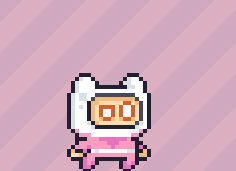
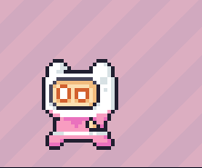
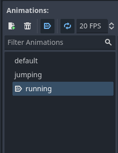

# Entry 2
##### 12/16/2024

# Content
## Goal and Process
After creating a sprite, canvas, map, and hitbox for my platformer game my goal throughout winter break was to add on to all these features to add the basic implementations of a platformer game like collision, movement, physics, and more. Some things I wanted to go over was animations and collision specifically. Throughout winter break I continued with these two videos that helped me go over the basics of what I wanted to implement in my platformer [1](https://www.youtube.com/watch?v=5V9f3MT86M8) and [2](https://www.youtube.com/watch?v=LOhfqjmasi0). Both of these videos contained tutorials on how to develop a platformer game which I followed.


## Animation
Following the tutorials, I learned how to implement animation onto my sprite, and on anything else I wanted. The first step was changing my Node: Sprite2D into a Animated2DSprite type. I turned the setting for animation type into Sprite animation and then added all my animation files into the Godot engine where files and folders are typically stored. Clicking the grid button while in the Sprite2D tab allows me to add frames from a sprite sheet which I have added through a downloaded resource pack. You are able to allocate frames, frame speed, and frame duration on any sprite you want. Doing this I was able to give my sprite an idle animation but the next step was to give it the ability to cycle through animations based on the type of action that is being played. Throughout these videos I learned some key functions and properties of the Godot engine such as how it operates its x and y axis'. I find it similar to P5JS where positive values are directed at the bottom vice versa. This knowledge can be implemented to flip animations based on the direction you're going. 
``` java
var isLeft = velocity.x < 0
	sprite_2d.flip_h = isLeft
```
The two lines of code created stores an indicator of if our player is inputting the key to move to the left and if that is the case the sprite flips horizontally. Now as shown below when the sprite isn't any direction other than neutral and right, it flips horizontally.





[Home](../README.md)

In order to assign specific animations based on the aciton such as running or jumping we can use conditionals and assign animations to them if met.

```java
if not is_on_floor():
		velocity += get_gravity() * delta
		sprite_2d.animation = "jumping"
```
```java
if (velocity.x > 1 || velocity.x < -1):
		sprite_2d.animation = "running"
	else:
			sprite_2d.animation = "default"
```

The code above shows us how we can assign our named animations, like variables, to conditionals giving us the effect of specific animations being played through certain actions. I believe this code can be extended to many other things in the future such as player death or startup of the game. The image below shows where the animation variables come from.



These are imported from the resource pack I've downloaded and is how we can assign animation in code.

## Physics

In order to create some quality of life changes in my game I started exploring some physics functions in the Godot Engine. In Godot physics, velocity is measured based off of maximum velocity, and something called steps. As you stop holding a movement key you will lose a value amount of steps gradually. My maximum velocity would be 300 and if my steps were 300 then my character would stop instantly. To create more realistic movement where you gradually slow down rather than immediately, I tweaked the step loss count in the code below.
```java
velocity.x = move_toward(velocity.x, 0, 10)
```
Previously the steps was assigned to our speed variable which determines our maximum velocity meaning you would stop immediately. Now having a step value of 10 you slow down then stop. This function within Godot I can see myself using for many things. Something I would definitely do with this is create different velocity effects for ice platforms for speeding up and slowing down respectively. This is what I currently have done towards the physics aspect of the Godot engine and I plan to do more with it to change up gameplay in my platformer

## Skills

* Learning things specific to the task at hand shouldn't only be used for that task. In the same sense I can use "steps" in godot to create a more realistic approach to movement in Godot I can also use that skill to be implemented in other areas like status effects or ground types like ice. It is always good to learn how to implement specific tools to a broader set of assignments/goals.

* Throughout learning about animation and physics in the Godot Engine I believe to be more creative than usual as learning and applying these skills allow me to start thinkig outside of the tutorial for what I could possibly create with these tools.