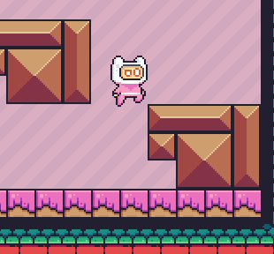
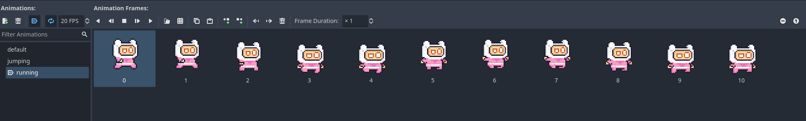

# Entry 3
##### 2/10/2025

# Content
## Progress
I wrote myself many goals set to be worked on and possibly done throughout christmas break as per my last blog entry. These goals were isted as creating a base framework for my platformer which works towards my MVP (Minimum Viable Product) where I can create the most basic verison of my realized and complete project. These goals were listed as: animation for sprites, qol changes, and physics for the game in the Godot engine. The first thing I went to complete were animations for my sprites and how to allocate them properly such as refresh rate, cycling, and proper transitions from one animation to another on the selected sprite. 

## Implementation
After learning how to implement animations on my sprite. I applied this through the change of my Sprite2D into the Animated2DSprite type. This information has been shared throughout the last blog but it is applied in this blog as shown below.


```c++
var isLeft = velocity.x < 0
	sprite_2d.flip_h = isLeft
```

The code above represents a simple rotation of the sprite depending on the direction the sprite is controlled. The image shown below is a representation of the many different settings you can tweak with the Animated2DSprite type child node as part of the CharacterBody2D parent node.
 
What is shown in the image above is where I am able to import a sprite sheet whilst being able to tweak and apply that sprite sheet onto my sprite. You are able to allocate frames, frame speed, and frame duration on any sprite you want using this animation tab. Likewise as things such as frame rate and animation refreshing can be tweaked using the Godot engine, some code is also necessary in order to make it look correct.
```c++
# Animations
	if (velocity.x > 1 || velocity.x < -1): 
		sprite_2d.animation = "running"
	else:
		sprite_2d.animation = "default"
	# Add the gravity.
	if not is_on_floor():
		velocity += get_gravity() * delta
		sprite_2d.animation = "jumping"
```
The code above is what's reponsible for how the animations will be played out according to the control of the sprite by the player.

## Physics

In order to create some quality of life changes in my game I started exploring some physics functions in the Godot Engine. In Godot physics, velocity is measured based off of maximum velocity, and something called steps. As you stop holding a movement key you will lose a value amount of steps gradually. My maximum velocity would be 300 and if my steps were 300 then my character would stop instantly. To create more realistic movement where you gradually slow down rather than immediately, I tweaked the step loss count in the code below.
```c++
velocity.x = move_toward(velocity.x, 0, 10)
```
Previously the steps was assigned to our speed variable which determines our maximum velocity meaning you would stop immediately. Now having a step value of 10 you slow down then stop. This function within Godot I can see myself using for many things. Something I would definitely do with this is create different velocity effects for ice platforms for speeding up and slowing down respectively.

## QOL Changes
I was able to create a camera function that follows my character sprite within movement. This was done by accessing my main character scene which is basically a folder/space where all actions/functions take place for my sprite. I accessed my CharacterBody2D node and gave it a child node Camera2D. This function gives the ability to manipulate the camera within the game. This allows the camera to follow the specific sprite and I can also control the zoom of it, etc. Moving forward I will be creating a lose and win condition for my game as part of what I need to have a complete game.

## Skills
* Many QOL changes were made because of my attention to detail as many small and insignificant adjustments were made to the game that will eventually add up to a better and more realized project. This really tells you how small skills implemented overtime will create a more satisfied product.

* One more skill I believe to have learned is proper organization as Godot engine utilizes parent and child nodes that can get messy. This is avoided by creating separate scenes for different parts of your project. For example I have a scene simply for my character and another for the map.


[Previous](entry02.md) | [Next](entry04.md)

[Home](../README.md)