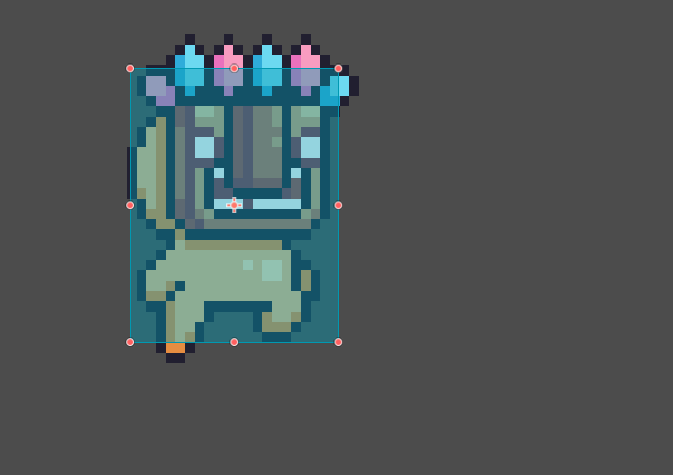
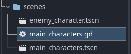

# Entry 4
##### 3/17/2025

# Content
## Progress
I've been continuing to learn my tool as MVP gets closer by watching many different youtube tutorials for different concepts and such and using Godot GDScript documentation. Throughout this I've had to less write and script with code but moreseo play with different nodes and how to implement them throughout the Godot engine.

## Implementation
I've decided that the next thing I wanted to do is have a enemy npc. This npc in its simplest form should kill you when he touches you. So far I have only used character nodes for my own player that I can control. I wasn't so sure how to create a enemy node that shares all the different scenes my game has. What I mean by this is how different events, collisions, etc apply to the enemy sprite as well. This [video](https://www.youtube.com/watch?v=kBzV7vgdQfU) specfically helped me do this.

\



This image above is what my end product of creating the enemy character. In its simplest form it should be able to be applied to collision events and be brought into different scenes where the player can interact with this enemy. In this case if you are touched by this enemy (hitboxes clashing) you would die in this instance. When creating this enemy I tried using what I had previously learned from creating my main player sprite. I replicated the process of creating the character sprite but leaving behind the fact that I control it. Throughout this process I created this character through the use of putting it in a subscene within the main scene. This was not the correct thing to do as nothing came out of it but a error. I simply gave it a normal scene and it had came into fruition.

## Physics/Event
After creating my enemy sprite I've also had to create the base function of dying that can apply to many different things. For example falling off the map, touching a certain sprite, etc will bring you back to a set spawn point. For an idea for my beyond MVP I will have a death screen which will prompt you to play again before you are teleported to said spawn point. In order to do this, I had to create a variable that holds the position/coordinates for where I would want to get teleported and a coordinate limit for how low you fall beneath the map (aka character getting voided) so that you'd "die" and respawn.

```gdscript
@onready var sprite_2d: AnimatedSprite2D = $Sprite2D
@export var teleport_position := Vector2(650, -200)
@export var fall_limit := 	1000

func _physics_process(delta: float) -> void:
	# Fall teleport check
	if global_position.y > fall_limit:
		global_position = teleport_position
```

This code is also subsequently applied to a collision event for the enemy sprite I created above. This code can also be applied to any sprite I want which allows us to create dangerous blocks/items that will kill you if collided with.

```gdscript
for i in get_slide_collision_count():
		var collision = get_slide_collision(i)
		if collision.get_collider().is_in_group("enemy"):
			global_position = teleport_position
```

## Skills
* Learning a lot of the base godot engine node and scene mechanics were necessary in order to create what I wanted. Code wasn't used as much to create my enemy character,

* Another skill I learned is the use of variables withing gdscript which I haven't really touched other than making basic number variables. Overall I learned how to utilize the nodes and scenes mechanics more and it has helped broaden my understanding of the godot engine.


[Previous](entry02.md) | [Next](entry04.md)

[Home](../README.md)