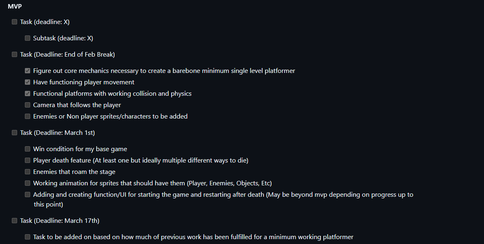
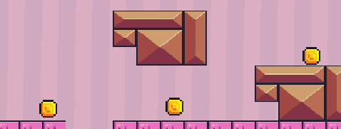
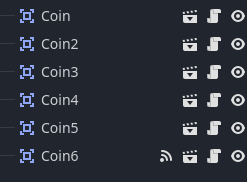

# Entry 5
##### 4/28/2025

# Content
## Progress
Throughout these final few weeks before finishing MVP I have prioritized work that will get me to finishing up my MVP.
## Implementation


### This image above shows us what I had written for what needs to be complete in order to have a finalized MVP (Minimum Viable Project). Based on the image above I have finished the first, second, and half of the third checklist. What needs to be done still is a win condition and getting the enemy sprites to move around. I have been able to implement multiple different ways you can die throughout my platformer but one of those ways (the enemy) is stationary making it no different then colliding with a object that kills you.



### I have been able to implement working coin sprites as well as functioning animations for the sprite using a [sprite sheet](https://brackeysgames.itch.io/brackeys-platformer-bundle) the problem with why my win condition isn't finished is because I want not only the player to make it to the end of the level, but having the condition of holding a certain amount of coins (10 or so) in order to move on. The coins are created and I gave them collision but I have yet to be able to fix the script for the pickup coin function:

```gdscript
extends Area2D


func _on_Coin_body_entered(body):
	print("+1 coin!")
	queue_free()
func _ready():
	connect("body_entered", Callable(self, "_on_body_entered"))
```



### One very important thing to note is that the coin sprite is allocated with its own tab for a script. This means said code will only go towards the coin sprite and nothing else. I may be having a problem due to this or the code itself is incapable of replicating what I want it to as the coin does not pick up properly and nothing prints on the collison of said coin. Otherwise everything for my MVP is done only leaving the two checkboxes I have not been able to complete and certain polishes like finishing up the map for my current level which has been used more-so like a baseplate as thus far.

## Skills
* I've been able to learn how attaching a script onto a sprite/object works within Godot but still find myself inexperienced with doing so as I come with issues freuqently. Nonetheless it is a new skill I've learned while using the godot engine

* Furthermore I have been able to assess what I would need to do in order to fully complete and polish my MVP.


[Previous](entry02.md) | [Next](entry04.md)

[Home](../README.md)