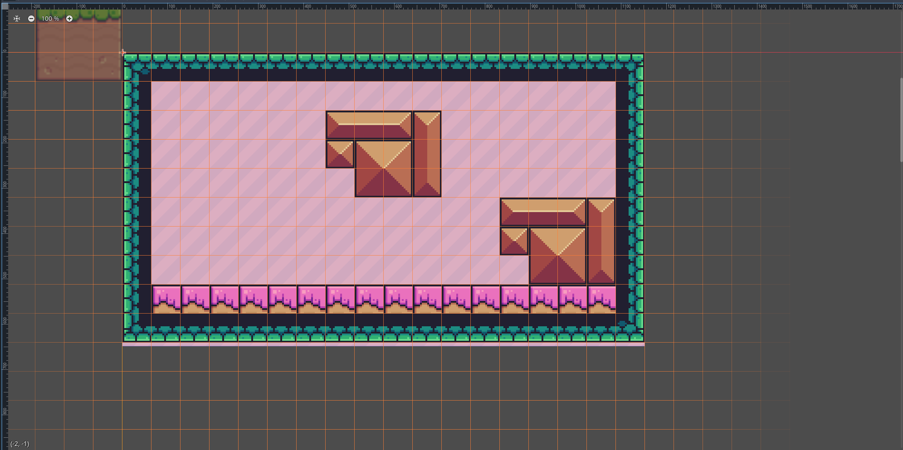
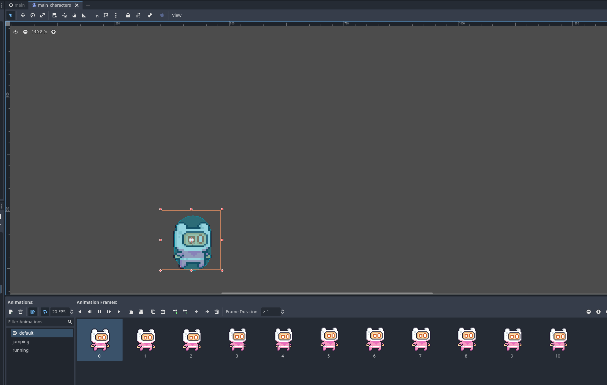
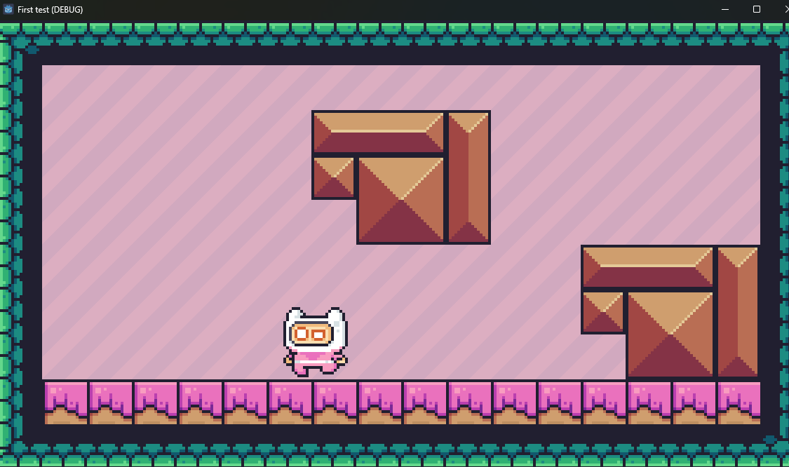

# Tool Learning Log

## Tool: **Godot**

## Project: **JJK PLATFORMER**

---

### 10/20/2024:
* I will be using the 2d element of godot
* Your scene is the thing that contains all the elements you add
* Throughout the 2d canvas, the blue box represents your game window
* I downloaded a pack full of assets such as backgrounds. Based on the tutorial I'm following I added a background png from the texture pack into the file. Using this I created a new node, TextureRect and dragged the png into it to create our background.
* Creating a new node child node, TileMap allows me to give it a terrain based on the texture pack and access terrain material from that texture pack. With it I can add tiles and create a map.
* 

### 11/4/2024:
* Added tiles outside of the map eliminating the chance of my character falling out boundaries
* Added CharacterBody2D Node
* This Node takes in two children nodes, sprite for the image it will be defined with, and collider with collision and hitbox purposes
* Subsequently added Sprite2D node and CollisionShape2D node as children of CharacterBody2D. We give the Sprite2D node a image, used for the sprite, then the collison node gives us a boxed collision box that we can size on our own
* There are different shapes and sizes you can change the collider into
* There is an issue with this though, when moving the sprite and its hitbox they are separate. We need to create a subscene for those two to be one object
* We create a scene in the Character node which basically saves all contents of the subfiles such as sprite and collision as one object. In order to edit them we can simply open up this scene where we will see the two folders separate again.
* Note (In order to save an edited scene simply press CTRL + S)

### 11/11/2024:
* The next step for me is to create code that allows me to move my character throughout the map/scene
* The first thing I did based was go to the Character scene I previous saved and created. I then opened a script in the root node which allows me to create and integrate a script onto the node
* We are given an option for a script template for the specific node "CharacterBody2D" and in this scenario Godot has a built in template for sprite movement which we will be utilizing
* This is what the code looks like:
```java
extends CharacterBody2D


const SPEED = 300.0
const JUMP_VELOCITY = -400.0


func _physics_process(delta: float) -> void:
	# Add the gravity.
	if not is_on_floor():
		velocity += get_gravity() * delta

	# Handle jump.
	if Input.is_action_just_pressed("ui_accept") and is_on_floor():
		velocity.y = JUMP_VELOCITY

	# Get the input direction and handle the movement/deceleration.
	# As good practice, you should replace UI actions with custom gameplay actions.
	var direction := Input.get_axis("ui_left", "ui_right")
	if direction:
		velocity.x = direction * SPEED
	else:
		velocity.x = move_toward(velocity.x, 0, SPEED)

	move_and_slide()

```
* Now gravity and basic movement is applied to the character
* The next issue comes with the fact that all we have is a character with gravity and a scene
* The scene doesn't physically have any collision which is what we will be creating next.
* I then proceed to add collision onto my map by going to the tile map node, selecting tile set, opening physics layer and finally adding element
* We then go on to opening our tileset adding the physics property onto it which allows us to paint or highlight the tiles that we want affected by physics. I simply painted all the tiles and now collision on blocks is possible meaning there are surfaces to walk on
* One thing to note with the code is instead of :
```java
var direction := Input.get_axis("ui_left", "ui_right")
```
* I changed it to:
```java
var direction := Input.get_axis("move_left", "move_right")
```
* For personal preference I changed the key inputs from left and right keys to "A" and "D" for left and right. I did this by going to project settings on godot, selecting input map, creating my two inputs move_left and move_right, then assigning them respectively their own inputs "A" and "D". Now I assigned this to the same code so the function is the same but the inputs are different.

### 11/25/2024:
* Continuing with my game in Godot I have created a map, sprite, hitboxes, collisions, and movement
* The next thing I need to do is add animations onto the sprite
* The first step was changing my Node: Sprite2D into a Animated2DSprite type
* I turned the setting for animation type into Sprite animation and then added all my animation files into the Godot engine where files and folders are typically stored.
* Clicking the grid button while in the Sprite2D tab allows me to add frames from a sprite sheet, I subsequently adjust the pixels of the sprite sheet in order for it to fit within the game.
* 
* Subsequently did the same thing for jumping and running animations and looped them within the game.
* One issue though is I need to figure out how to alternate throughout these animations so that when I'm standing still, idle animation plays, vice versa.
* At this point on only the selected animation will play when I run the scene.

### 12/9/2024
* In Godot the x and y axis' operate differently from standard convention. Positive values are directed at the bottom. If I recall correctly this is similar to how the canvas works in P5JS
* For the animation of my sprite, the animation only moves one way. What I mean by this is when running to the right or left it plays the same animation.
* In order to fix this, in the offset section of for the Sprite2D Node, there is a button that flips the sprite and it's animation. I can flip it vertically or horizontally.
* I will need to add to my code where turning left flips it horizontally and turning right flips it horizontally where it faces the right similarly.
* Essentially I will have to access the node through the script.
* In order to save a reference of your node in the script. You can drag your node into the script. To make sure it stays as a reference, hold ctrl before releasing it into your script.
* We create a reference of our node like the name implies to use it for later for convenience.
```
var isLeft = velocity.x < 0
	sprite_2d.flip_h = isLeft
```
* The two lines of code created stores an indicator of if our player is inputting the key to move to the left and if that is the case the sprite flips horizontally. Now as shown below when the sprite isn't any direction other than neutral and right, it flips horizontally.


### 1/13/2025
* Moving on I started adding consequent animation tweaks based off of movement with my sprite sheet. If the player jumps it should play the jump animation, etc.
* You do this under the physics function. It's pretty simple as you assign the sprite an animation based on your conditional shown below.
```java
if not is_on_floor():
		velocity += get_gravity() * delta
		sprite_2d.animation = "jumping"
```
```java
if (velocity.x > 1 || velocity.x < -1):
		sprite_2d.animation = "running"
	else:
			sprite_2d.animation = "default"
```
* In Godot physics, velocity is measured based off of maximum velocity, and something called steps. As you stop holding a movement key you will lose a value amount of steps gradually. My maximum velocity would be 300 and if my steps were 300 then my character would stop instantly. To create more realistic movement where you gradually slow down rather than immediately, I tweaked the step loss count in the code below.
```java
velocity.x = move_toward(velocity.x, 0, 10)
```
* Previously the steps was assigned to our speed variable which determines our maximum velocity meaning you would stop immediately. Now having a step value of 10 you slow down then stop.
* Something to note is gravity is changed in Godot's project settings.
<!--
* Links you used today (websites, videos, etc)
* Things you tried, progress you made, etc
* Challenges, a-ha moments, etc
* Questions you still have
* What you're going to try next
-->
